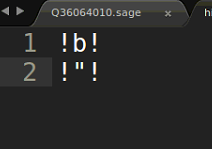
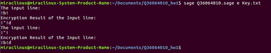
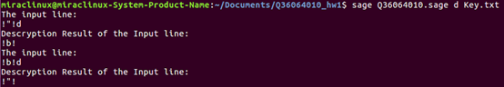

# Sage-Hill-Cipher
**The goal of this program is to implement Hill Cipher using Sage.** <br/>
Sage is a powerful mathematic software which can compute matrix determinants and inverses. <br/>
What's more, you can write Python code and call Sage's function in a sage program,which is really helpful and useful.<br/>
This program is able to do the following:<br/>
1) Read the Key matrix from a text file, e.g.,'Key.txt'. **The key can be a matrix of any dimension (nxn).**<br/>
2) Read a text file,e.g.,'plainText.txt', encrypt its content, and save the result in another file. The program will  partition the
file into blocks and encrypt them separately.<br/>
3) Restore the ciphertext file,e.g.,'cipherText.txt', back to plaintext.<br/>**4) The program is able to handle all the ASCII code characters**

## Perform Encryption
```
sage hillCipher.sage e [key matrix file] [plaintext file]
```
e.g.,
```
sage hillCipher.sage e Key.txt plainText.txt
```

## Perform Decryption
```
sage hillCipher.sage d [key matrix file] [ciphertext file]
```
e.g.,
```
sage hillCipher.sage d Key.txt cipherText.txt
```

Both Encryption and Decryption will create a text file ,'hillCipherOutput.txt', and store the result in it.

## What's special about this Hill Cipher?
**When I use the nxn Key matrix(n is a positive integer) to perform Encryption or Decryption, 
It can handle the situation that the number of characters stored in hillCipherInput.txt can't be divided by n.**

For example, if I use a 2x2 Key matrix like this,<br/>
<br/>
<br/>and the number of characters stored in hillCipherInput.txt can't be divided by 2 .(There are 3 characters per line)<br/>
<br/>
<br/>We append some spaces(' ') to the plaintext content of hillCipherInput.txt to make it be divided by 2.<br/>
<br/>
<br/>Then we remove the spaces(' ') after decryption to restore the original plaintext.<br/>
<br/>
